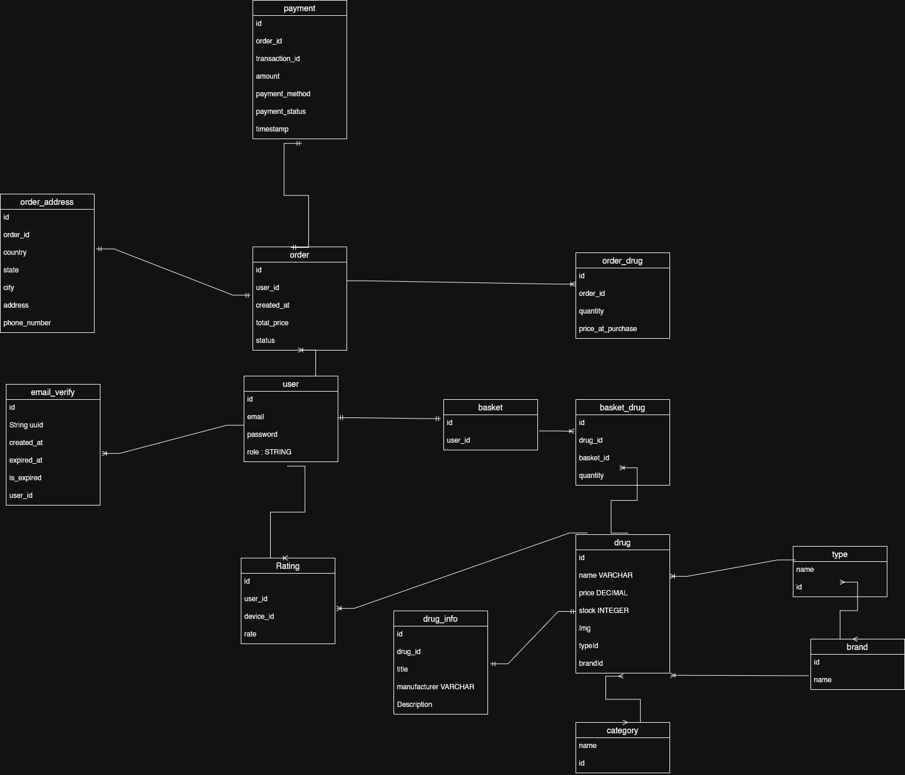

# E-Commerce Drug Store

A full-stack e-commerce platform architected for the pharmaceutical industry, focusing on data integrity, inventory management, and secure transaction processing.

## System Overview

This application addresses the specific requirements of an online drug store, where product tracking and historical order accuracy are critical. It provides a robust backend API for managing a complex catalog of pharmaceutical products and a responsive frontend dashboard for customer interaction.

### Core Capabilities

- **Secure Authentication**: Stateless JWT-based authentication and authorization.
- **Catalog Management**: Hierarchical inventory system (Types, Brands, Categories, Drugs).
- **Session Management**: Persistent shopping basket logic.
- **Order Processing**: Transactional lifecycle management from basket to fulfillment.
- **Payment Architecture**: Extensible design for integration with payment gateways (e.g., Stripe).

## Domain Model & Data Design

The database schema is designed in **3rd Normal Form (3NF)** to ensure data consistency and eliminate redundancy. The system follows a strict `User -> Basket -> Order -> Payment` lifecycle, visible in the referenced ER diagram.

### Key Design Decisions

1.  **Basket & Order Lifecycle**:

    - **Pre-Purchase**: The `Basket` entity maintains a 1:1 relationship with `User`. Items are stored in `BasketDrug`, a join table that holds the specific `quantity` for that session.
    - **Transactional Snapshot**: When an order is placed, items are effectively "moved" to the `Order` entity. Crucially, we use a separate join table, `OrderDrug`, to snapshot the **price at the moment of purchase**. This ensures that subsequent price changes in the product catalog do not corrupt historical financial records.

2.  **Normalization vs. Performance**:

    - Product data is highly normalized across `Drug`, `DrugInfo`, `Brand`, `Type`, and `Category` tables. This structure prevents data anomalies (e.g., inconsistent brand names) and allows for flexible filtering and reporting, a necessary trade-off against join complexity.

3.  **Transactional Boundaries**:
    - **Basket Operations**: Atomic updates to prevent race conditions during inventory checks.
    - **Order Creation**: A compound transaction that validates stock, deducts inventory, archives the basket state into an order, and creates the initial payment record.

## Architecture

The system follows a **Layered Architecture** to enforce separation of concerns.

### Backend (Spring Boot)

- **Controller Layer**: Exposes RESTful endpoints, handles DTO mapping, and manages HTTP responses.
- **Service Layer**: Encapsulates business logic (e.g., stock validation, price calculation).
- **Repository Layer**: Manages data persistence using Spring Data JPA.
- **Security**: Custom `JwtFilter` integrated into the Spring Security chain for stateless request validation.

### Frontend (React)

- **Design System**: Dashboard-style layout implemented with Tailwind CSS.
- **State Management**: React Hooks for local component state; centralized auth context.
- **Routing**: Client-side routing via React Router DOM.

## Technology Stack

- **Backend**: Java 17, Spring Boot 3.5.7, Spring Security 6, JJWT 0.11.5
- **Database**: PostgreSQL (Production), H2 (Development/Test)
- **Frontend**: TypeScript 5.9, React 19, Vite 7, Tailwind CSS 4, Axios
- **Tools**: Maven, Postman (API Testing)

## Implementation Status

The project is currently in active development.

### Backend

- ✅ **Authentication**: Registration, Login, and JWT Token generation.
- ✅ **Catalog**: CRUD operations for Drugs, Brands, and Categories.
- ✅ **Basket**: Logic for adding/removing items and quantity management.
- ⚠️ **Order & Payment**: Domain model designed and entities created; business logic pending implementation.

### Frontend

- ✅ **Authentication**: Fully functional Login and Registration pages with error handling.
- ✅ **Layout**: Responsive Dashboard shell implementation.
- ⚠️ **Core Features**: Product browsing and checkout flows are currently under construction.

## Setup & Development

### Prerequisites

- Java 17+
- Node.js 20+

### Backend Setup

1.  Navigate to the backend directory: `cd drug_store`
2.  Start the application: `./mvnw spring-boot:run`
3.  The API will accept requests at `http://localhost:8080`.

### Frontend Setup

1.  Navigate to the frontend directory: `cd frontend-ecommerce-drug-store`
2.  Install dependencies: `npm install`
3.  Start the development server: `npm run dev`
4.  Access the UI at `http://localhost:5173`.

## Engineering Trade-offs

- **Stateless Auth (JWT)**: We chose JWTs over server-side sessions to enable horizontal scalability of backend services. The trade-off is the complexity of implementing token revocation strategies.
- **Join Tables for Line Items**: Using explicit entities (`OrderDrug`) instead of JSON columns allows for efficient SQL aggregation (e.g., "Top selling drugs this month") at the database level, which is critical for e-commerce reporting.
