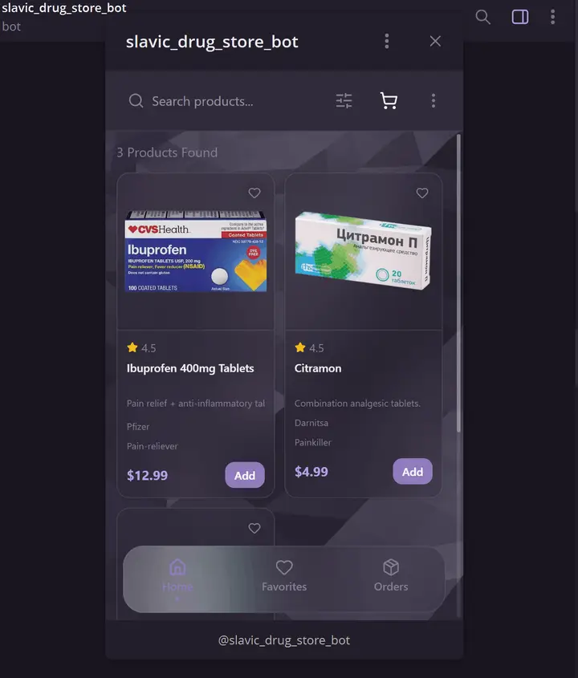
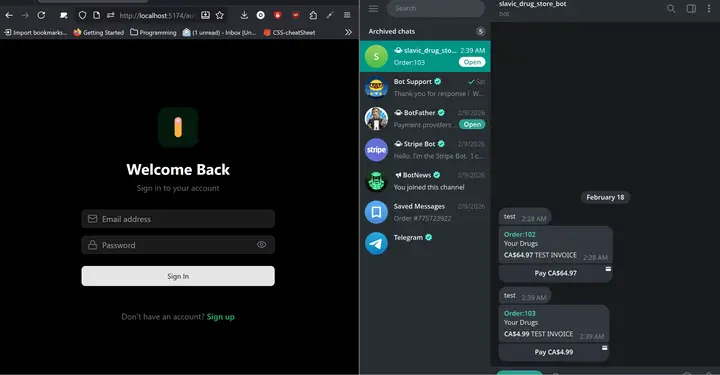
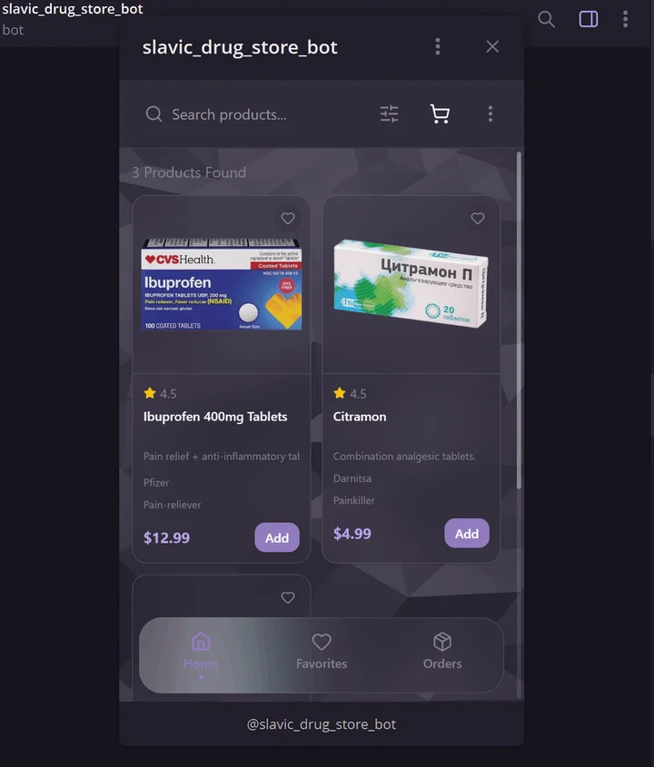
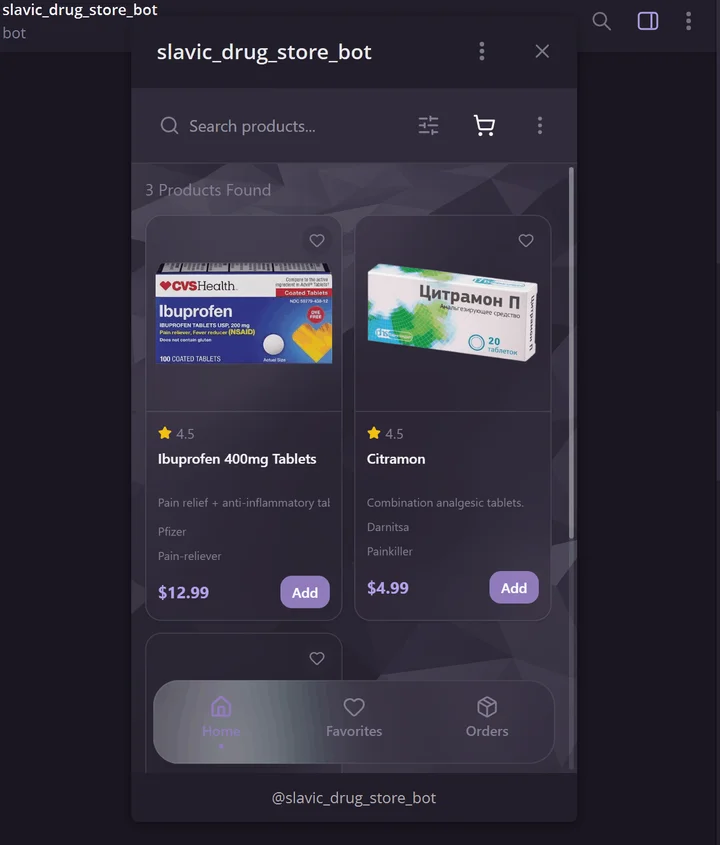
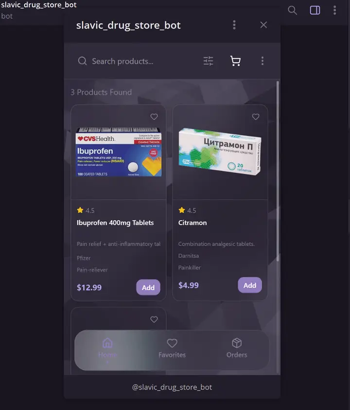
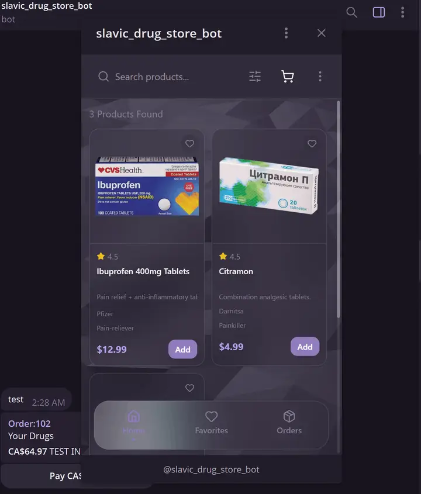
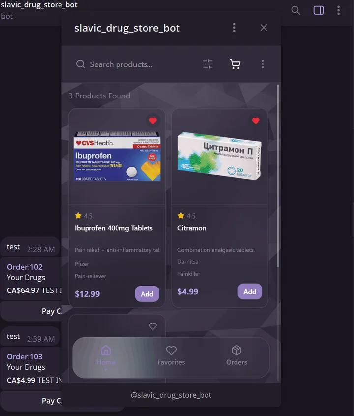
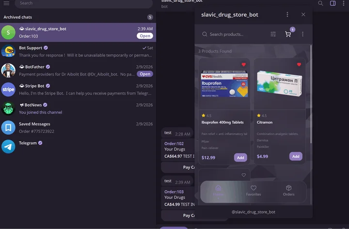
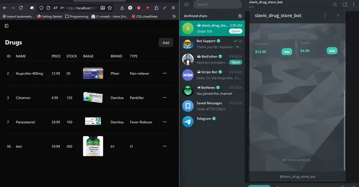

# E-Commerce Telegram Mini App

> A full-stack e-commerce app built as a **Telegram Mini App**, featuring a real payment flow with Telegram invoices, live order-status sync, an admin panel, and support for three languages.




---

## What is this?

A full-stack e-commerce store that lives inside Telegram as a Mini App. Users log in, browse a product catalog, add items to their basket, and place orders — at which point a real Telegram invoice is sent to the chat and payment is processed through Telegram's payment system. Order status updates sync in real-time between the Telegram chat and the app. A separate admin panel lets store managers add, edit, and remove products, brands, and categories, with changes reflected immediately in the store.

---

## Showcase

### Opening the App

First launch and login flow.


---

### Authentication

Login to the client store and the admin panel simultaneously.



---

### Navigation & UI

Menus, page transitions, and the overall layout.


---

### Search & Filter

Real-time search combined with filters for type, brand, and category.



---

### Favorites

Save products to a personal favorites list.



---

### Basket to Checkout to Telegram Invoice

Add items to the basket, go through checkout, enter address and payment info, and receive an invoice directly in the Telegram chat.



---

### Orders & Live Payment Status Sync

Order status shown in the app stays in sync with the Telegram chat — paying in the chat updates the app instantly.



---

### Multi-Language Support

Switch between English, Russian, and Ukrainian — the entire app updates instantly.



---

### Telegram Theme Sync

The app reads Telegram's active color palette and adapts its theme automatically — light or dark.



---

### Admin Panel — Drug Management

Add a new drug from the admin panel and watch it appear in the store in real time.


---

### Admin Panel — Types, Brands & Categories

Edit or remove drug types, brands, and categories — updates reflect in the store immediately.



---

## Tech Stack

| Layer | Technologies |
| --- | --- |
| Backend | Spring Boot 3.5.7 · Java 17 · PostgreSQL · Spring Security · JWT · JPA/Hibernate |
| Frontend | React 19 · TypeScript · Vite · Tailwind CSS · Axios |
| Bot & Payments | Telegram Bot API · FastAPI (Python) |

---

## Setup & Running

### Prerequisites

- Java 17+
- PostgreSQL running on `localhost:5432` with a database named `SpringDrugStore`
- Node.js 18+
- Python 3.10+ (for the Telegram bot)

### Environment variables

Backend (`drug_store/src/main/resources/application.properties` or env):

```env
JWT_SECRET=<your_jwt_secret>
EMAIL_USER=<your_gmail>
EMAIL_PASSWORD=<your_gmail_app_password>
```

### Run

**Backend:**

```bash
cd drug_store
mvn spring-boot:run
# Runs on http://localhost:8080
```

**Frontend:**

```bash
cd frontend-ecommerce-drug-store
npm install
npm run dev
# Runs on http://localhost:5173
```

**Telegram bot:**

```bash
cd telegram-bot
pip install -r requirements.txt
uvicorn main:app --port 8000
```
